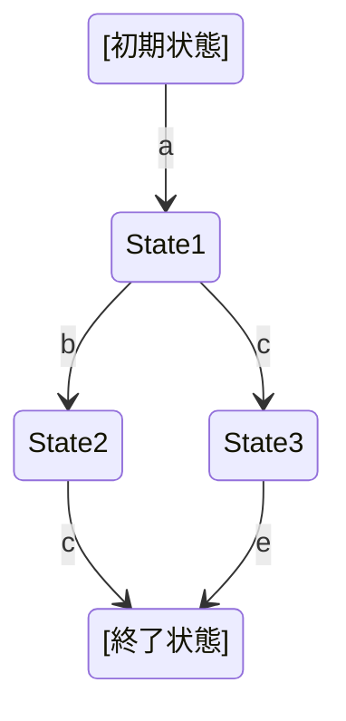
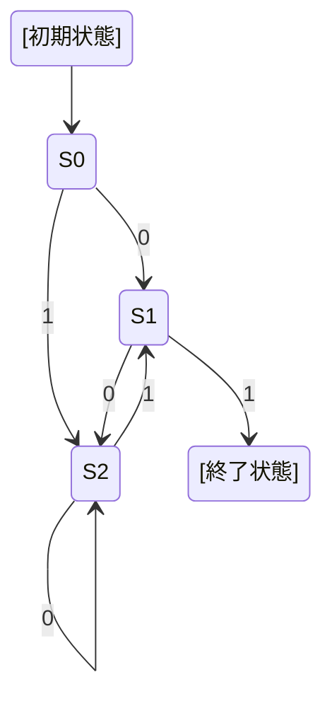
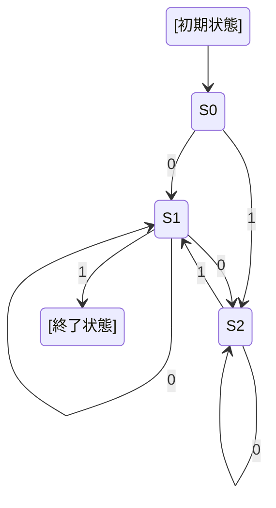
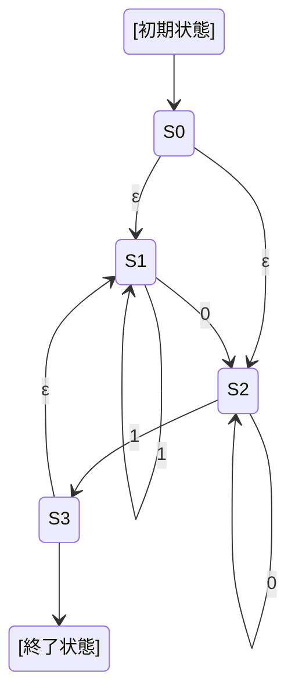
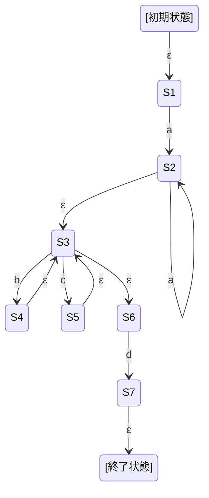
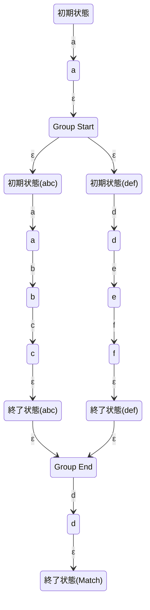

# 正規表現エンジンを作って学ぶ正規表現

## プロット

- 正規表現とは何が出来るものか
- 正規表現の動作原理
- 今回実装する正規表現の仕様の説明
- どの様に実装するかの説明
- 実装の解説

## 正規表現とは何か？

正規表現とは、特定のパターンにマッチする文字列を見つける為の規則を備えたパターン記述言語です。

正規表現で記述できる代表的な要素には以下のものがあります。

- `abc`: リテラル. 正規表現に書いた文字と全く同じ文字にマッチする。
- `.`: ドット. 任意の1文字にマッチする。
- `*`: 繰り返し. 直前のパターンが0回以上繰り返されることを示す。
- `|`: 選択. `|`の左右に書いたどちらかにマッチする。
- `()`: グループ化. `(abc)*` の様に直前の1個よりも長いパターン列を一体として扱う時に使う。
- `^`: 位置を表すマーカー. 文字列の先頭にマッチする。
- `$`: 位置を表すマーカー. 文字列の末尾にマッチする。

正規表現にマッチする文字列の事を正規言語と呼びます。

## 正規表現で表せないもの

正規表現は日常や業務で扱う様々なパターンを持った文字列を表す事ができますが表せないものもあります。

例えば `((()))` の様に入れ子構造になった括弧が正しく対応を取れているかどうかをチェックする正規表現は書けません。

チェック対象の文字列に再帰的な構造が含まれている場合はより表現力の高いパーサーを作れる手法が必要になります。

## 正規表現の動作原理

正規表現はオートマトン(automaton)と呼ばれるコンピューター用の数理モデルに変換して動作します。

### オートマトンとは

オートマトンはステートマシン(state machine)とも呼ばれ『状態』と『状態遷移』で構成されます。
初期状態と終了状態を持ち、最終的に終了状態になれば一連の処理を受理して正常終了します。

正規表現と関係があるオートマトンとしては次の様なものがあります。

- DFA (決定性有限オートマトン)
- NFA (非決定性有限オートマトン)
- ε-NFA (ε-非決定性有限オートマトン)

この3種のオートマトンの名前に共通して入っている有限というのは状態数が有限という意味です。

DFAはある状態から何をするとどの状態に遷移するのかが一意に定まっているオートマトンです。

例:

NFAはある状態から何をするとどの状態に遷移するのかが**一意に定まっていない**オートマトンです。

例:

DFAの図と比べるとS1で0が入力された場合に自分自身(S1)に遷移する可能性と、S2に遷移する可能性の2つが同時に存在する様になりました。
全ての遷移の可能性を辿っていって最終的にどれか1つでも終了状態に辿り着いたらNFAは受理された事になります。

ε-NFAはNFAに何もしないまま次の状態へ遷移する事を許した特殊なNFAです。

例:

DFAとNFAとε-NFAの能力は同じです。
DFA < NFA < ε-NFAの順に同じオートマトンでも簡潔に書ける様になっているのでまずはε-NFAで考えていきましょう。

### 正規表現をオーマトンに変換する例

正規表現ではオートマトンが終了状態で終わる事を入力文字列がマッチしたと解釈します。
終了状態に辿り着けなかった場合はマッチしなかったと解釈します。

これを念頭に `aa*(b|c)*d` という正規表現をε-NFAで表してみましょう。

## 今回実装する正規表現の仕様の説明

話を簡単にする為に、一般的な正規表現の中の次の機能を実装します。

- **リテラル** 書いた文字にそのままマッチする。ただし`.`, `|`, `*`, `()`は制御記号として使うので書けない。
- **dot** `.` 1文字限定のワイルドカード文字
- **連接** `aiu` の様に左から右に順番に見ていくこと
- **選択** `|` どちらかにマッチ
- **繰り返し** `*` 0回以上の繰り返し
- **グループ化** `()`で1つのパターンとして扱えるようにする

## どの様に実装するかの説明

- 正規表現をε-NFAに変換する方法で実装します。
- また実装を簡易化する為に選択・繰り返し・グループ化は初期状態と終了状態を持つ独立して動作可能なオートマトンに変換します。
  - つまり`abc|def`は`abc`と`def`にそれぞれ対応する完全なε-NFAを作って実行します。
  - 内部的に実行するオートマトンの初期状態にε遷移して終了状態からε遷移で帰ってくるイメージです。

`a(abc|def)d`という正規表現を今回の実装でε-NFAに変換した図。

## 実装の解説

実装には以下の要素を満たす言語のうち、私が一番得意なRustを用いています。

- 型とその型が取り得るデータ構造のパターンを分かりやすく定義できる (代数的データ型, 直和型)
  - ε-NFAの実装に必要
- UTF8文字列をUnicodeコードポイントの配列に変換できる
  - ε-NFAの実装を分かりやすくするのに必要
- 再帰的なグラフ構造の型を簡単に定義できる
  - ε-NFAの実装を分かりやすくするのに必要
- 使いやすいパーサーコンビネータライブラリがある
  - 正規表現のパーサーを作るのに必要

残りはコードを見ながら説明します。

流れは以下の通りです。

1. 正規表現のパースはスキップ
2. NFAをコードでどの様に表しているか
3. NFAが入力文字列を処理する流れ
4. 実際に動かしてみる

## 実行に必要なソフトウェア

- Rust言語処理系
  - こちらから案内に従ってインストールできます <https://www.rust-lang.org/ja/tools/install>

## 実行方法

- ユニットテストを実行する
  - `cargo test`
- プログラムのmain関数を実行する
  - `cargo run`
