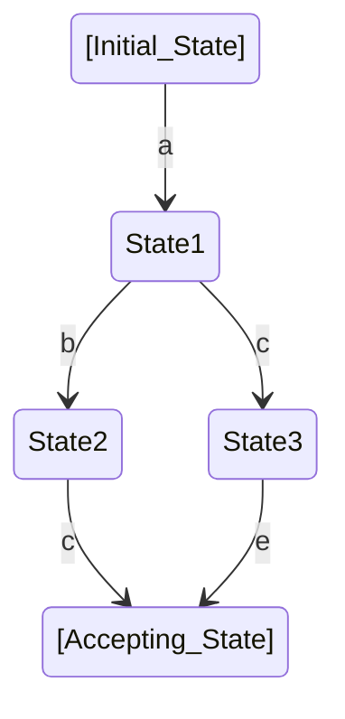
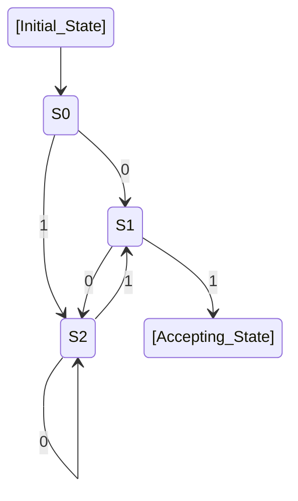
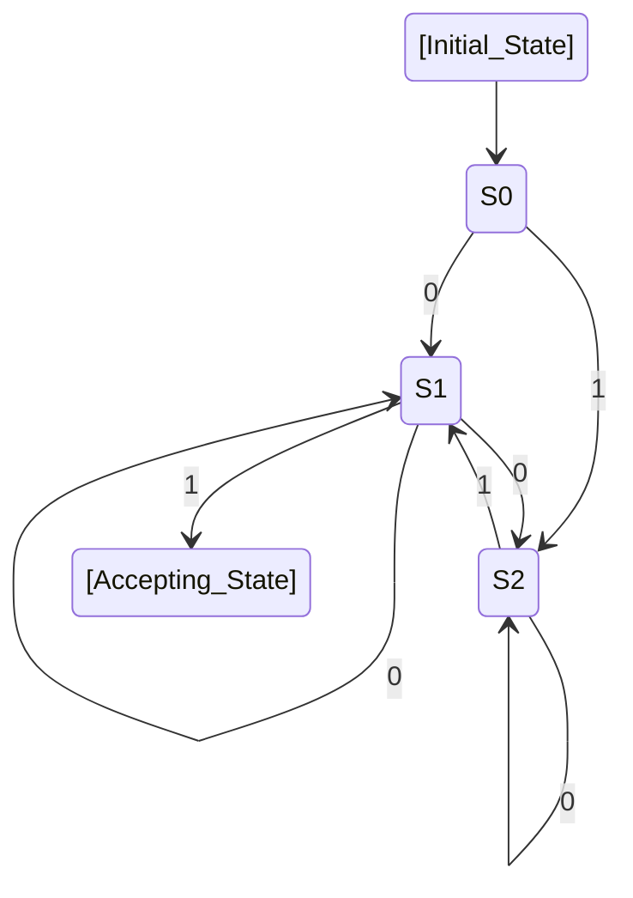
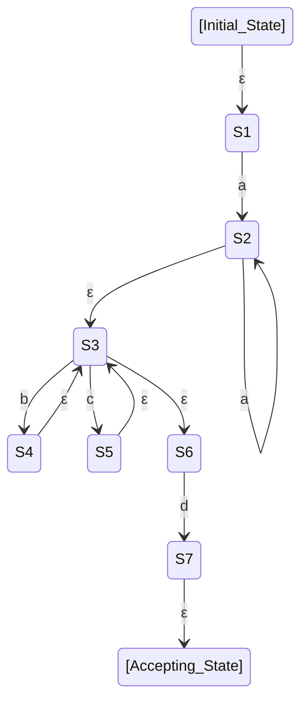
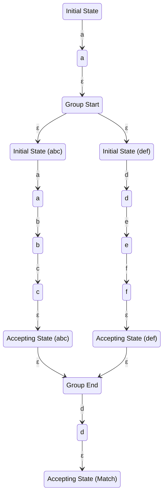

# Learning Regular Expressions by Building a Regex Engine

## Overview

- What can regular expressions do?
- The operational principles of regular expressions
- Explanation of the regular expression specifications we will implement
- How we will implement it
- Explanation of the implementation

## What are Regular Expressions?

Regular expressions are a pattern description language equipped with rules to find strings that match specific patterns.

Typical elements that can be described with regular expressions include:

- `abc`: Literal. Matches exactly the characters written in the regular expression.
- `.`: Dot. Matches any single character.
- `*`: Repetition. Indicates that the preceding pattern can be repeated zero or more times.
- `|`: Choice. Matches either the pattern on the left or the right of `|`.
- `()`: Grouping. Used when treating a sequence of patterns longer than one, like `(abc)*`, as a single unit.
- `^`: Position marker. Matches the start of the string.
- `$`: Position marker. Matches the end of the string.

Strings that match a regular expression are referred to as regular languages.

## What Regular Expressions Cannot Express

While regular expressions can represent various patterned strings encountered in daily life and work, there are things they cannot express.

For example, a regular expression cannot be written to check whether nested parentheses like `((()))` are correctly paired.

If the string to be checked contains recursive structures, a more expressive parsing method is needed.

## Operational Principles of Regular Expressions

Regular expressions operate by being converted into a mathematical model for computers known as an automaton.

### What is an Automaton?

An automaton, also called a state machine, consists of "states" and "state transitions".
It has an initial state and an accepting state, and if it reaches the accepting state, the sequence of operations is accepted and ends successfully.

The types of automata related to regular expressions include:

- DFA (Deterministic Finite Automaton)
- NFA (Non-deterministic Finite Automaton)
- ε-NFA (Epsilon Non-deterministic Finite Automaton)

The term finite in these names means that the number of states is finite.

A DFA is an automaton where it is uniquely determined which state to transition to from a given state.

Example:

An NFA is an automaton where it is not uniquely determined which state to transition to from a given state.

Example:

Compared to the DFA diagram, in the NFA, when 0 is input at S1, there is a possibility of transitioning to itself (S1) and to S2 simultaneously.
If any of the possible transitions eventually reach an accepting state, the NFA is considered to have accepted.

### Example of Converting Regular Expressions to Automata

Regular expressions interpret reaching an accepting state as the input string matching.
If the accepting state is not reached, it is interpreted as not matching.

With this in mind, let's represent the regular expression `aa*(b|c)*d` with an ε-NFA.

## Specifications of the Regular Expressions to be Implemented

To simplify the discussion, we will implement the following features of regular expressions:

- **Literal**: Matches the exact characters written. However, `.`, `|`, `*`, `()` are control symbols and cannot be written.
- **Dot**: `.` A wildcard character that matches any single character.
- **Concatenation**: `aiu` Looks at characters from left to right.
- **Choice**: `|` Matches either.
- **Repetition**: `*` Zero or more repetitions.
- **Grouping**: `()` Treats multiple patterns as a single pattern.

## How We Will Implement

- We will implement by converting regular expressions to ε-NFA.
- To simplify the implementation, choices, repetitions, and groupings will be converted into independent automata with their own initial and accepting states.
  - Thus, `abc|def` will each correspond to a complete ε-NFA that is executed.
  - The idea is to transition from the initial state of the internal automaton to the accepting state via ε-transitions.

Diagram of the regular expression `a(abc|def)d` converted to ε-NFA for this implementation.

## Explanation of the Implementation

Let's discuss the code:

1. **Parsing of Regular Expressions**: We skip the detailed parsing of regular expressions.
2. **Representation of NFA in Code**: How we represent the NFA using data structures and classes.
3. **Processing of Input Strings by NFA**: The flow of how the NFA processes the input string to determine matches.
4. **Running Examples**: Demonstrating the operation with actual examples.

This approach allows us to understand the mechanics behind regular expressions and their implementation as automata, providing a clear and practical understanding of both theoretical and applied aspects.
